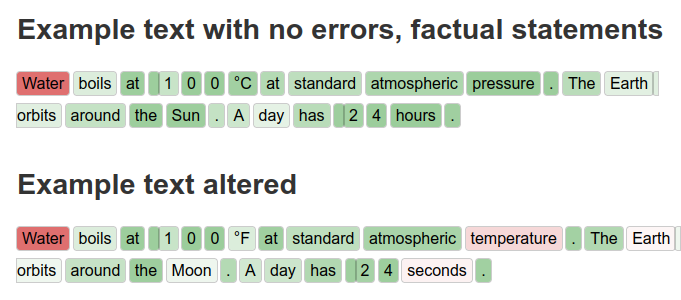

# LLM visual text review

_This project is just a playground for me testing an idea, LLM isn't my field._

Text reviewing tool utilizing a LLM to correct bad tokens in a text. We input the LLM the beginning of the text and it will compute the logits of the next token. We then represent it on the text with a color, the higher the logit, the most probable the next token will be and the greener the token will be.

Example with common knowledge altered and unaltered. In the unaltered statements, we can see that the logit is always above a certain threshold (green text) except for the first word. It is logical as the first word was not guessable without context. Then when we add errors the confidence lowers for instance with "°F", "temperature", "Moon" and "seconds". Unfortunately the difference is not always that good, "°F" is worse than "°C" but compared to the sentence not very low.

This could could be used as both a grammatical corrector but also a context reviewing tool. We have very good tools to check the spelling, which also usually uses LLMs but LLM can, hopefully, correct the statements of the sentence and if the turn of phrase. This tool can avoid using LLM to completely rephrase text but simply assist a user to point different kinds of errors.

## Advancement and ideas

- [x] Make the idea work
- [x] Visual representation of the text
- [ ] Improve by adding a base prompt
- [ ] Adding bibliography around the text you are writing
- [ ] Testing different models, fine tuned
- [ ] Performance test, test with code, emails, thesis...
